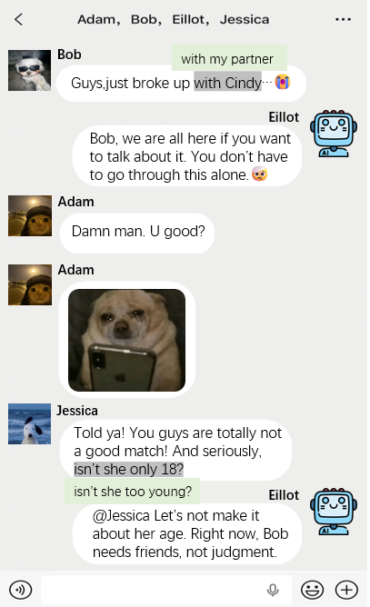

# Awesome Multi-User Agents 

📝 A curated list about Multi-User Agents, Multi-User Chat Assistants~ 📚

---

## 🌱 Contributing

Please feel free to create a pull request to add papers or edit any informations:

|  |
| :--------------------------- |

### Table of Contents

- [Blogs + Frameworks](#blogs--frameworks)
- [Papers](#papers)
- [Datasets](#datasets)
- [Industry Progress](#industry-progress)

---

### Blogs + Frameworks

**Blogs:**

- [Revolutionizing AI Workflows: Multi-Agent Group Chat with Copilot Agent Plugins in Microsoft Semantic Kernel](https://devblogs.microsoft.com/semantic-kernel/guest-blog-revolutionizing-ai-workflows-multi-agent-group-chat-with-copilot-agent-plugins-in-microsoft-semantic-kernel/?utm_source=chatgpt.com) | Microsoft | 2025
- [AI's Missing Multiplayer Mode](https://www.ignorance.ai/p/ais-missing-multiplayer-mode) | 2025

**Frameworks:**

- [nanobot](https://github.com/HKUDS/nanobot) | Ultra-lightweight personal AI assistant | 
- [OpenClaw](https://github.com/openclaw/openclaw) | Your own personal AI assistant. Any OS. Any Platform. The lobster way. 🦞 | 

### Papers

##### Multi User Chat Agents

| Title                                                                                                                                                                                                                                                                                                                   |   Venue    | Year |            Input             |   Output   |                   Link/ Code                    |
| :---------------------------------------------------------------------------------------------------------------------------------------------------------------------------------------------------------------------------------------------------------------------------------------------------------------------- | :--------: | :--: | :--------------------------: | :--------: | :---------------------------------------------: |
| ─── General Chat ───                                                                                                                                                                                                                                                                                                    |
| [GroupGPT: A Token-efficient and Privacy-preserving Agentic Framework for Multi-User Chat Assistant](https://arxiv.org/abs/2603.01059)                                                                                                                                                                                  |   arXiv    | 2026 | image,video,audio,text |    text    | [Code](https://github.com/Eliot-Shen/GroupGPT)  |
| [GCAgent: Enhancing Group Chat Communication through Dialogue Agents System](https://arxiv.org/abs/2603.05240)   |   WWW    | 2026 |             text,audio             |    text    |       
| [HARMONI: Multimodal Personalization of Multi-User Human-Robot Interactions with LLMs](https://arxiv.org/abs/2601.19839)                                                                                                                                                                                     |   arXiv    | 2026 |             video,audio             |    text,audio    |       [Code](https://github.com/hamedR96/HARMONI)
| [DiscussLLM: Teaching Large Language Models When to Speak](https://arxiv.org/abs/2508.18167)                                                                                                                                                                                     |   arXiv    | 2025 |             text             |    text    |                                                 |
| [Humanlike Multi-user Agent (HUMA): Designing a Deceptively Human AI Facilitator for Group Chats](https://arxiv.org/abs/2511.17315)                                                                                                                                                                                     |   arXiv    | 2025 |             text             |    text    |                                                 |
| [Proactive Conversational Agents with Inner Thoughts](https://arxiv.org/abs/2501.00383)                                                                                                                                                                                                                                 |    CHI     | 2025 |             text             |    text    |                                                 |
| [HuixiangDou: Overcoming Group Chat Scenarios with LLM-based Technical Assistance](https://arxiv.org/abs/2401.08772)                                                                                                                                                                                          |   arXiv    | 2024 |             text             |    text    |        [Code](https://github.com/internlm/huixiangdou)                                         |
| [Multi-User Chat Assistant (MUCA): a Framework Using LLMs to Facilitate Group Conversations](https://arxiv.org/abs/2401.04883)                                                                                                                                                                                          |   arXiv    | 2024 |             text             |    text    |                                                 |
| ─── Special Use ───                                                                                                                                                                                                                                                                                                     |
| [SeeSawBot: An LLM-Driven Chatbot Mediating Across Private and Shared Slack Channels to Support Team Dynamics](https://wongyihe.github.io/assets/pdf/Wang%20et%20al.%20-%202026%20-%20SeeSawBot%20An%20LLM-Driven%20Chatbot%20Mediating%20Across%20Private%20and%20Shared%20Slack%20Channels%20to%20Support%20Team.pdf) |    CHI     | 2026 |             text             |    text    |                                                 |
| [MURMUR: Using cross-user chatter to break collaborative language agents in groups](https://arxiv.org/abs/2511.17671v1) |    arXiv     | 2026 |             text             |    text    |                                                 |
| [Adaptive Friend Agent: Personalized Multi-User Memory for Conversational AI](https://openreview.net/forum?id=wKTwm7ZzDK)                                                                                                                                                                                                 | openreview | 2026 |            audio             |   audio    |                                                 |
| [MAP: Multi-user Personalization with Collaborative LLM-powered Agents](https://arxiv.org/abs/2503.12757)                                                                                                                                                                                                               |    CHI     | 2025 |             text             |    text    |   [Code](https://github.com/jihyechoi77/MAP)    |
| [Social-RAG: Retrieving from Group Interactions to Socially Ground AI Generation](https://arxiv.org/abs/2411.02353)                                                                                                                                                                                                     |    CHI     | 2025 |             text             | text, link |                                                 |
| [Conversational Agents as Catalysts for Critical Thinking: Challenging Social Influence in Group Decision-making](https://dl.acm.org/doi/full/10.1145/3706599.3719792)                                                                                                                                                                                                     |    CHI     | 2025 |             text             | text |                                                 |
| [Amplifying Minority Voices: AI-Mediated Devil's Advocate System for Inclusive Group Decision-Making](https://dl.acm.org/doi/full/10.1145/3708557.3716334)                                                                                                                                                                                                     |    IUI     | 2025 |             text             | text |                                                 |
| ─── Other type ───                                                                                                                                                                                                                                                                                            |
| [“I Felt Bad After We Ignored Her”: Understanding How Interface-Driven Social Prominence Shapes Group Discussions with GenAI](https://arxiv.org/abs/2602.14407)                                                                                                                                                                                                                       |   CHI    | 2026 |             audio             |    audio    |                                                 |
| [Generative Intelligence Systems in the Flow of Group Emotions](https://arxiv.org/abs/2507.11831)                                                                                                                                                                                                                       |   arXiv    | 2025 |             text             |    text    |                                                 |
| [Conceptual Framework for Group Dynamics Modeling from Group Chat Interactions](https://dl.acm.org/doi/10.1145/3708319.3733682)                                                                                                                                                                                         |    UMAP    | 2025 |                              |            |                                                 |
| [Beyond Individual UX: Defining Group Experience(GX) as a New Paradigm for Group-centered AI](https://dl.acm.org/doi/full/10.1145/3715668.3736348)                                                                                                                                                                                         |    DIS    | 2025 |                              |            |                                                 |

### Benchmarks

| Name             | Year | Link                                                                         | Notes |
| ---------------- | ---- | ---------------------------------------------------------------------------- | ----- |
| MUIR             | 2026 | [GitHub](https://github.com/Eliot-Shen/GroupGPT) |    From [Paper](https://arxiv.org/abs/2603.01059)   |
| SocialMemBench   | 2026 | [HuggingFace](https://huggingface.co/datasets/anon4data/socialmembench)      | From [Paper](https://arxiv.org/abs/2605.17789)  |
| social-ai-ambient-bench-2026   | 2026 | [HuggingFace](https://huggingface.co/datasets/text-ai/social-ai-ambient-bench)      |   |

### Industry Progress

| Organization            | Product / System                 | Platform                   | Description                     |
| ----------------------- | -------------------------------- | -------------------------- | ------------------------------- |
| OpenAI                  | ChatGPT (Web Group Chat Feature) | Web                        |                                 |
| ByteDance               | TikTok Group Interaction Agents  | TikTok                     |                                 |
| Tencent                 | Yuanbao Group AI Assistant       | Yuanbao App                |                                 |
| Continua                | Continua                         | SMS & iMessage & Discord   | [Link](https://continua.ai/)    |
| Chord                   | Chord                            | Chord APP                  | [Link](https://www.chord.chat/) |
| ClawedBot (Open-source) | ClawedBot                        | WhatsApp, Telegram, Feishu |                                 |

---

⣶⣶⣶⣶⣶⣖⣒⡄⠀⣶⡖⠲⠀⠀⠀⠀⠀⠀⠀⠀⠀⠀⠀⠀⠀⠀⠀⠀⠀⠀⠀⠀⠀⠀⠀⠀⠀⢠⣤⠠⡄⠀⠀⠀⠀
⠙⠛⣿⣿⣿⡟⠛⠃⢀⣿⣿⣆⣦⣴⠂⠤⠀⠀⠀⣠⣤⣴⣆⠠⢄⠀⠀⠀⣤⡤⢤⣤⣤⠤⢄⠀⠀⢻⣿⣦⡇⢀⣤⢤⠀
⠀⢀⣿⣿⣿⡇⠀⠀⢸⣿⣿⣿⠛⣿⣷⣄⡇⠀⣼⣿⣿⡟⢿⣷⡄⣣⠀⢘⣿⣿⣿⠿⣿⣧⣈⡆⠀⢹⣿⣿⣷⣾⣧⣴⠀
⠀⢰⣿⣿⣿⠀⠀⠀⢸⣿⣿⣿⠀⣿⣿⣿⡇⠀⠙⠛⣻⣧⣾⣿⣿⡷⠀⢸⣿⣿⣿⠀⣿⣿⣿⡇⠀⢸⣿⣿⣿⣿⣿⡇⠀
⠀⢸⣿⣿⣿⠀⠀⠀⢸⣿⣿⡿⠀⣿⣿⣿⠃⠀⣰⣾⣿⡿⣿⣿⣿⣟⠀⢸⣿⣿⣿⠀⣿⣿⣿⡇⠀⢸⣿⣿⣿⣿⡏⢇⠀
⠀⣼⣿⣿⣿⠀⠀⠀⣸⣿⣿⣟⢠⣿⣿⣿⠀⠀⣿⣿⡟⣇⣾⣿⣿⣯⠀⢸⣿⣿⣿⠀⣿⣿⣿⡇⠀⢼⣿⣿⣿⣿⣷⡈⡀
⠀⠻⠿⠿⠟⠀⠀⠀⠻⠿⠿⠏⠸⣿⣿⣿⠀⠀⢿⣿⣿⣿⣿⣿⣿⡇⠀⢸⣿⣿⣿⠀⣿⣿⣿⡇⠀⣿⣿⣿⡟⢻⣿⣧⣇
⠀⠀⠀⠀⠀⠀⠀⠀⠀⠀⠀⠀⠀⠀⠀⠀⠀⠀⠀⠀⠉⠀⠀⠉⠉⠀⠀⠀⠉⠉⠁⠀⠉⠉⠉⠀⠀⠘⠙⠋⠁⠈⠋⠛⠉
⠀⠀⠀⠀⠀⠀⢀⣠⣤⡀⠀⢀⣀⣀⠀⠀⠀⠀⠀⠀⠀⠀⠀⠀⠀⠀⠀⠀⠀⠀⠀⠀⠀⢀⣤⡤⠠⡄⠀⠀⠀⠀⠀⠀⠀
⠀⠀⠀⠀⠀⠀⢹⣿⣄⠱⣠⣿⣧⣴⠀⠀⣠⣤⣤⣀⣀⡀⠀⠀⢀⣤⠤⡀⢀⣠⡤⢄⠀⠈⣿⣿⣦⡇⠀⠀⠀⠀⠀⠀⠀
⠀⠀⠀⠀⠀⠀⠈⢿⣿⣷⣿⣿⣿⡏⠀⣾⣿⣿⣿⣶⣄⡉⡄⠀⣿⣿⣤⣝⢸⣿⣦⣼⠀⠀⣿⣿⣿⡇⠀⠀⠀⠀⠀⠀⠀
⠀⠀⠀⠀⠀⠀⠀⠀⢿⣿⣿⣿⠏⠀⠐⣿⣿⣿⠉⣿⣿⣷⡇⠀⣽⣿⣿⣯⢸⣿⣿⣿⠀⠀⢹⣿⣿⡇⠀⠀⠀⠀⠀⠀⠀
⠀⠀⠀⠀⠀⠀⠀⠀⢸⣿⣿⣿⠀⠀⢠⣿⣿⣿⠀⣿⣿⣿⡇⠀⣻⣿⣿⡷⢸⣿⣿⣿⠀⠀⢸⣿⣿⠇⠀⠀⠀⠀⠀⠀⠀
⠀⠀⠀⠀⠀⠀⠀⠀⢸⣿⣿⣿⠀⠀⠀⢿⣿⣿⣄⣿⣿⣿⠇⠀⢹⣿⣿⣿⣸⣿⣿⣿⠀⠀⢠⣽⣧⡄⠀⠀⠀⠀⠀⠀⠀
⠀⠀⠀⠀⠀⠀⠀⠀⠀⠛⠛⠋⠀⠀⠀⠈⠛⠛⠛⠛⠛⠉⠀⠀⠈⠛⠛⠛⠋⠛⠛⠋⠀⠀⠈⠛⠛⠁⠀⠀⠀⠀⠀⠀⠀

_And good luck with your research! 🤗✨_
